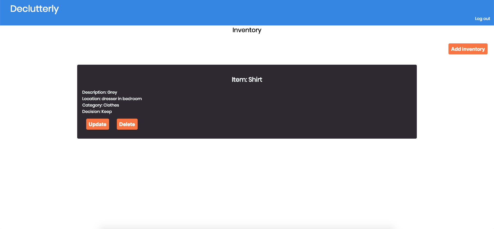

### Link to live version: https://declutterly.herokuapp.com/

Username: test
Password: testpass123

This project was bootstrapped with [Create React App](https://github.com/facebook/create-react-app).

## Introduction: 

This app allows users to list items in their household and decide whether to keep or discard. 

## Screenshots

#### Landing

#### Dashboard

#### Add Inventory

## Technical:
### Front-End: 
* React.js 
* Redux 
* CSS3 
* Testing with Enyzme

### Back-End: 
* Node.js
* Express.js
* MongoDB

### Testing and Deployment: 
* Mocha
* Chai
* Travis CI
* Heroku
* mLab

